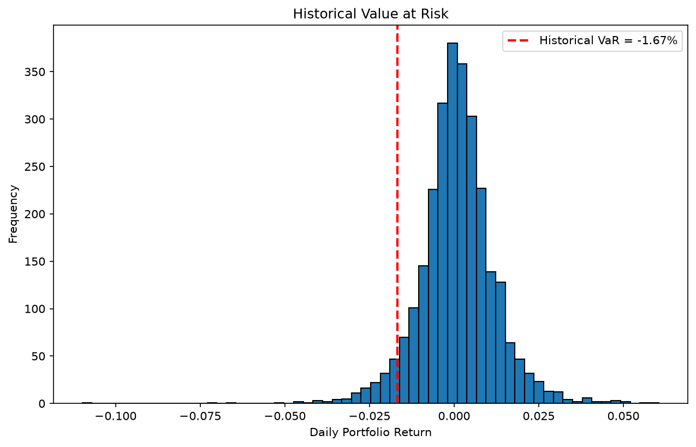
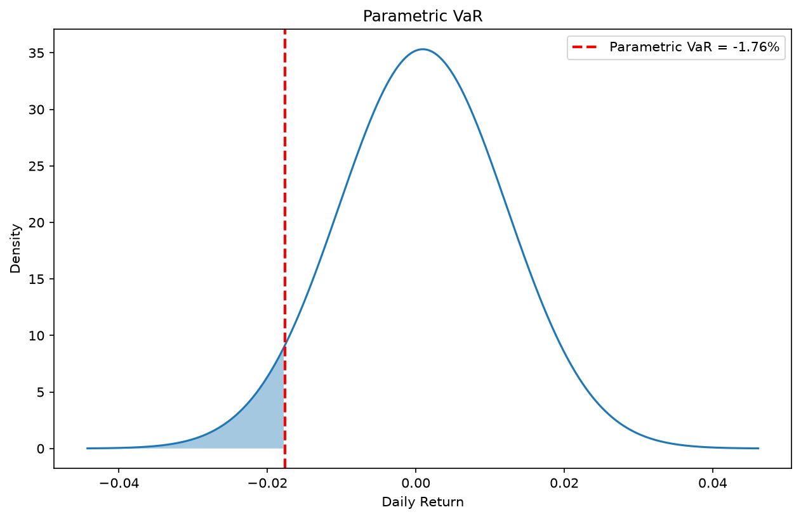
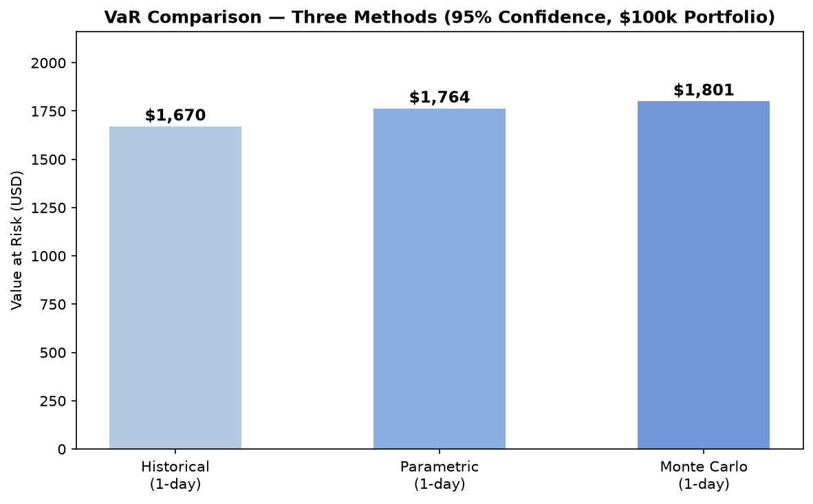
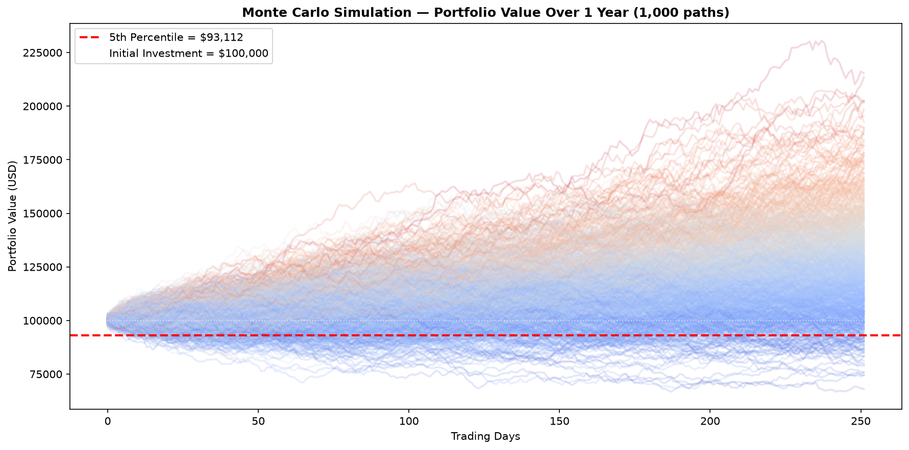
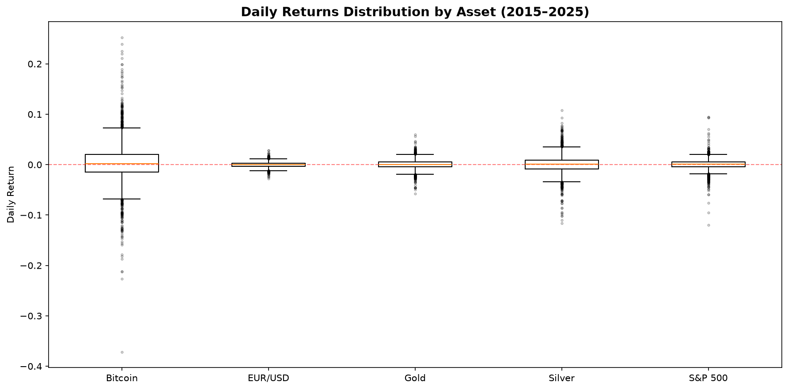
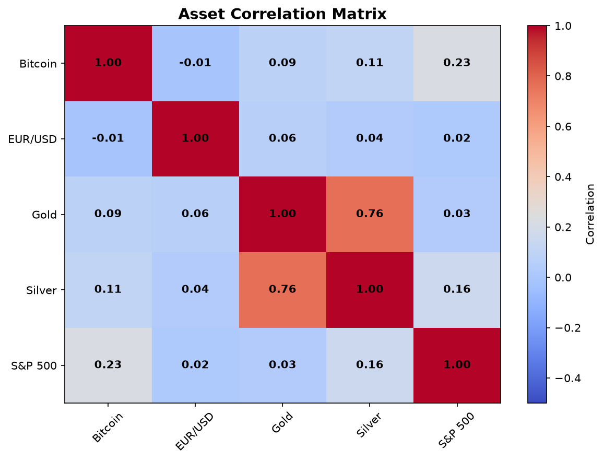

# Value at Risk (VaR) Calculator — Multi-Asset Portfolio (2015–2025)

## Overview

Value at Risk (VaR) is one of the most widely used measures of 
market risk in finance. It estimates the maximum expected loss 
of a portfolio over a given time horizon at a specified 
confidence level. In simple terms: a 1-day VaR of $1,670 at 
95% confidence means that, on any given day, there is a 5% 
probability of losing more than $1,670.

This project implements and compares three VaR methodologies,
Historical, Parametric, and Monte Carlo, applied to a 
diversified portfolio of five diverse instruments across different 
asset classes. Beyond calculating a number, the goal is to 
understand what each method assumes, where it fails, and why 
the results differ.

---

## Portfolio

An equally-weighted portfolio of $100,000 across five assets:

| Asset | Ticker | Weight | Asset Class |
|---|---|---|---|
| Bitcoin | BTC-USD | 20% | Cryptocurrency |
| EUR/USD | EURUSD=X | 20% | Forex |
| Gold | GC=F | 20% | Metal |
| Silver | SI=F | 20% | Metal |
| S&P 500 | ^GSPC | 20% | Index |

This combination was chosen to represent genuinely diverse 
risk profiles, from the most volatile to the most 
stable, and to test whether diversification 
meaningfully reduces portfolio risk relative to individual 
asset risk.

---

## Data

- **Source:** Yahoo Finance (yfinance)
- **Period:** January 2015 - December 2025
- **Frequency:** Daily closing prices
- **Returns:** Daily percentage returns (not price levels)

---

## Methodology

### 1. Historical VaR

The simplest and most intuitive approach. It makes no 
assumption about the distribution of returns — it simply 
takes the actual historical returns and finds the percentile 
corresponding to the chosen confidence level.

For a 95% confidence level, Historical VaR is the 5th 
percentile of the distribution of past daily portfolio returns.

**Advantage:** captures real distributional features, including 
fat tails and skewness/asymmetries.  
**Limitation:** assumes the past is representative of the future. 
Rare events that do not appear in the historical window are ignored.

### 2. Parametric VaR

Also known as the Variance-Covariance method. It assumes 
portfolio returns follow a normal distribution, characterized 
entirely by their mean (μ) and standard deviation (σ).

The formula is:

**VaR = μ + z · σ**

Where z is the z-score corresponding to the confidence level 
(-1.645 for 95%).

**Advantage:** fast and analytically clean.  
**Limitation:** real financial returns are not normally distributed. 
They have fat tails: extreme losses occur more frequently 
than the normal distribution predicts. This means Parametric 
VaR can underestimate true tail risk, especially for assets 
like Bitcoin.

### 3. Monte Carlo VaR

Simulates a large number of possible future scenarios by 
drawing random returns from the estimated return distribution. 
This project runs two versions:

- **1-day simulation (10,000 scenarios):** comparable to 
  Historical and Parametric VaR.
- **1-year simulation (1,000 paths):** simulates full portfolio 
  trajectories over 252 trading days, showing the range of 
  possible outcomes at a longer time horizon.

**Advantage:** flexible, can incorporate non-normal distributions 
and longer time horizons.  
**Limitation:** results vary slightly each run due to randomness. 
The quality of the simulation depends on the quality of the 
assumed return distribution.

---

## Results

| Parameter             |                    Value |
| --------------------- | -----------------------: |
| Confidence level      |                      95% |
| Initial Portfolio     |                 $100,000 |
| Number of simulations |                   10,000 |
| Time Horizon          | 1 Day / 252 Trading Days |

### 1-Day VaR Comparison (95% Confidence, $100k Portfolio)

| Method | VaR (USD) | VaR (%) |
|---|---|---|
| Historical | -$1,670 | -1.67% |
| Parametric | -$1,764 | -1.76% |
| Monte Carlo (1-day) | -$1,801 | -1.80% |

All three methods converge around $1,670–$1,800, which gives 
confidence that the estimate is robust. The small differences 
reflect each method's assumptions:

- Historical VaR is the lowest because it is anchored to what 
  actually happened, and this portfolio's historical returns 
  include a period of strong performance that pulls the 
  distribution upward.
- Parametric and Monte Carlo produce slightly higher estimates in this sample due to the estimated volatility of the portfolio. In general, however, assuming normally distributed returns may underestimate tail risk because financial returns often exhibit fat tails.

### Monte Carlo 1-Year Simulation

| Metric | Value |
|---|---|
| Initial Investment | $100,000 |
| 5th Percentile Portfolio Value | $93,079 |
| 1-Year VaR (95%) | -$6,888 (-6.89%) |

Over a full year, the 5% worst-case scenario results in a 
portfolio value of approximately $93,000, a loss of around 
$6,900 from the initial investment. The 1,000 simulated 
trajectories also show significant upside potential, with 
some paths reaching above $200,000, reflecting the positive 
expected return of the portfolio over time.

Note: The Monte Carlo model assumes future returns follow the same statistical properties estimated from historical data. It generates thousands of possible future scenarios rather than forecasting actual market movements.

---

## Visualizations

### Daily Returns Distribution by Asset

Bitcoin clearly dominates in terms of tail risk — its 
interquartile range and outliers are far wider than any other 
asset. EUR/USD is the most compressed, consistent with its 
role as a major, highly liquid currency pair. The risk ranking 
from the boxplot is:
**Bitcoin > Silver > Gold ≈ S&P 500 > EUR/USD**

### Asset Correlation Matrix

The portfolio benefits from genuine diversification. Bitcoin 
and EUR/USD have a near-zero correlation (-0.01), meaning 
they move almost independently. The only meaningful 
cross-asset correlation is Gold–Silver (0.76), which is 
expected given their shared cathegory and drivers (inflation expectations, 
real interest rates, safe-haven demand...). The low overall 
inter-asset correlations explain why the portfolio VaR is 
substantially lower than a simple weighted average of 
individual asset VaRs would suggest.

---

## Discussion

**Which method estimates the highest risk?**  
Monte Carlo at the 1-day horizon gives the most conservative 
estimate ($1,801), although the differences between methods are 
small, around $130 between the lowest and highest estimate. 
This convergence suggests the results are stable and not 
highly sensitive to methodological choice for this portfolio.

**What are the limitations of assuming normality?**  
The Parametric method assumes returns follow a normal 
distribution, but real financial returns, especially 
Bitcoin's, have fat tails. This means extreme losses happen 
more frequently than the normal distribution predicts. For 
a portfolio heavily exposed to crypto, Parametric VaR likely 
underestimates true tail risk.

**How does diversification affect VaR?**  
Significantly. The correlation matrix shows that most assets 
in this portfolio move largely independently of each other. 
A portfolio where all assets were perfectly correlated would 
have a VaR approximately equal to the weighted average of individual VaRs. 
The low correlations here reduce that number substantially:
diversification works.

**What does VaR not tell you?**  
VaR tells you the threshold loss at a given confidence level, 
but not how bad losses can get beyond that threshold. A 
portfolio could have a $1,700 VaR at 95% but suffer a 
$50,000 loss on a bad day — VaR says nothing about that. 
This is the main motivation for Conditional VaR (CVaR), 
also known as Expected Shortfall, which measures the average 
loss in the worst 5% of scenarios.

---

## Future Improvements

- **Conditional VaR (CVaR / Expected Shortfall):** the natural 
  next step — measures average loss beyond the VaR threshold
- **Rolling VaR:** track how VaR evolves over time, revealing 
  periods of elevated risk
- **GARCH volatility modeling:** replace constant volatility 
  with a time-varying model that captures volatility clustering

---

## Tools

- Python 3
- yfinance · pandas · numpy · matplotlib · scipy · statistics

## Author

Irene Corral Trillo  
Economics Student — Universidade da Coruña    
[GitHub](https://github.com/iirenecor)
